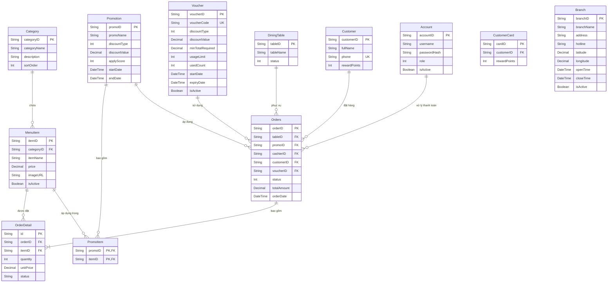

# HỒ SƠ THIẾT KẾ HỆ THỐNG - THE SELF STATION (DESIGN.md)

Chào mừng bạn đến với tài liệu thiết kế chi tiết của dự án **The Self Station** — một hệ sinh thái nhà hàng tự phục vụ (Self-Service Restaurant) khép kín, hiện đại và đồng bộ. Tài liệu này cung cấp cái nhìn toàn diện về cấu trúc thư mục, kiến trúc phần mềm, sơ đồ cơ sở dữ liệu, các luồng nghiệp vụ cốt lõi, hệ thống thiết kế giao diện (Design System) và cơ chế xử lý thời gian thực.

---

## 1. Tổng Quan Hệ Thống (System Overview)

**The Self Station** được phát triển nhằm mục đích tối ưu hóa quy trình vận hành của nhà hàng, giảm thiểu thời gian chờ đợi của khách hàng và tự động hóa việc đồng bộ dữ liệu giữa các bộ phận. Dự án bao gồm 4 phân hệ chính:

1. **Website Giới Thiệu (Public Landing Page):** Trang thông tin quảng bá thương hiệu, thực đơn đặc sắc, các chương trình khuyến mãi và tính năng tìm kiếm vị trí cửa hàng tích hợp API địa chính Việt Nam.
2. **Kiosk Đặt Món (Customer Kiosk Terminal - `/kiosk`):** Đặt tại các bàn ăn hoặc quầy tự phục vụ. Khách hàng chủ động chọn món, áp dụng thẻ tích điểm thành viên, tạo đơn hàng và theo dõi tiến độ chế biến món ăn của mình.
3. **Màn Hình Bếp (Kitchen Display System - `/kds`):** Dành riêng cho nhân viên bếp để tiếp nhận đơn từ Kiosk theo thời gian thực (Real-time), cập nhật trạng thái chế biến của từng món ăn (`WAITING` $\rightarrow$ `COOKING` $\rightarrow$ `DONE`).
4. **Quầy Thu Ngân (POS Cashier - `/pos/cashier`):** Hỗ trợ thu ngân quản lý trạng thái bàn ăn, liên kết tài khoản thành viên vào hóa đơn, kiểm tra & áp dụng mã Voucher giảm giá, tiến hành thanh toán (Checkout) và kết xuất báo cáo doanh thu ca làm việc.
5. **Trang Quản Trị (Admin Dashboard - `/`):** Giúp người quản lý (Admin) điều phối toàn bộ hệ thống bao gồm quản lý thực đơn, tài khoản nhân viên, các chương trình khuyến mãi/giảm giá và biểu đồ báo cáo thống kê doanh số.

---

## 2. Kiến Trúc Phần Mềm & Công Nghệ (Architecture & Tech Stack)

Dự án được cấu trúc theo mô hình **Monorepo** chia tách rõ ràng thành các khu vực riêng biệt:

```
THE SELF STATION (Root)
├── Website/               # Trang Landing Page quảng bá (HTML/CSS/JS thuần)
├── backend/               # Server API (Node.js, Express, Socket.io, Prisma ORM)
└── frontend/              # Ứng dụng nghiệp vụ (React, Vite, Axios, TailwindCSS, Socket.io-client)
```

### Chi Tiết Công Nghệ Sử Dụng:
*   **Backend Server:** 
    *   **Node.js & Express:** Xây dựng RESTful API xử lý các yêu cầu nghiệp vụ.
    *   **Prisma Client:** ORM quản lý, truy vấn dữ liệu MySQL một cách an toàn và tối ưu hóa hiệu năng bằng các Transaction.
    *   **Socket.io:** Đảm bảo truyền tải thông tin tức thời (Real-time) giữa Kiosk, KDS và POS Cashier mà không cần tải lại trang.
*   **Frontend Business App:**
    *   **React (Vite):** Xây dựng giao diện ứng dụng nhanh, mượt mà và chia nhỏ thành các Component tái sử dụng.
    *   **TailwindCSS & Vanilla CSS:** Thiết lập hệ thống UI với cấu trúc responsive chặt chẽ.
    *   **React Router:** Quản lý điều hướng và phân quyền theo vai trò người dùng (Admin, Cashier, Kitchen).
*   **Website Marketing:**
    *   Sử dụng HTML5, CSS3 và Javascript thuần (Vanilla JS) để tối ưu SEO, tốc độ tải trang và tích hợp hiệu ứng chuyển động mượt mà (marquee, slider, tab switching).

---

## 3. Thiết Kế Cơ Sở Dữ Liệu (Database Schema)

Hệ thống sử dụng cơ sở dữ liệu **MySQL**, được quản lý và cấu hình thông qua tập tin [schema.prisma](file:///d:/Workspace/The%20Self%20Station/backend/prisma/schema.prisma). Sơ đồ quan hệ thực thể (ERD) bao gồm các bảng cốt lõi sau:



### Chi Tiết vai trò của các bảng dữ liệu:
*   **DiningTable (Bàn ăn):** Lưu trữ mã bàn và trạng thái (`status: 0` = Bàn trống, `status: 1` = Bàn đang có khách).
*   **Orders & OrderDetail (Đơn hàng & Chi tiết đơn hàng):**
    *   `Orders.status`: Trạng thái tổng của đơn hàng (`0` = Mới/Chờ thanh toán, `2` = Đã thanh toán và hoàn tất đơn).
    *   `OrderDetail.status`: Trạng thái xử lý của từng món ăn cụ thể trong bếp (`WAITING` = Chờ chế biến, `COOKING` = Đang nấu, `DONE` = Đã xong và sẵn sàng phục vụ, `CANCELLED` = Đã hủy, `OUT_OF_STOCK` = Hết món).
*   **Voucher & Promotion (Mã giảm giá & Khuyến mãi):** Quản lý các chương trình ưu đãi tự động áp dụng trực tiếp lên món ăn hoặc mã giảm giá áp dụng vào hóa đơn tổng khi thanh toán tại quầy.
*   **Customer & CustomerCard (Khách hàng & Thẻ thành viên):** Tích lũy điểm thưởng (`rewardPoints`) dựa trên giá trị hóa đơn thực tế (ví dụ: mỗi 1,000 VND tương đương 1 điểm).

---

## 4. Hệ Thống Vai Trò & Phân Quyền (User Roles & Permissions)

Ứng dụng nghiệp vụ hỗ trợ cơ chế bảo vệ Route ([ProtectedRoute](file:///d:/Workspace/The%20Self%20Station/frontend/src/App.jsx#L26-L45)) dựa trên phân quyền tài khoản lưu trong `localStorage`:

| Vai Trò (Role ID) | Tên Phân Hệ | Quyền Truy Cập Các Đường Dẫn (Route) |
| :--- | :--- | :--- |
| **Không đăng nhập** | Kiosk Khách Hàng | `/kiosk`, `/login` |
| **Admin (Role = 1)** | Trang Quản Trị Hệ Thống | Toàn quyền truy cập tất cả các route bao gồm: `/` (Dashboard), `/menu` (Thực đơn), `/accounts` (Nhân viên), `/promotions` (Khuyến mãi), `/reports` (Báo cáo), `/pos` (Thu ngân), `/kds` (Bếp) |
| **Cashier (Role = 2)** | Quầy Thu Ngân & POS | Truy cập `/pos`, `/pos/cashier`, `/pos/report`, `/reports` (chỉ xem báo cáo doanh số) |
| **Kitchen (Role = 3)** | Bộ Phận Bếp & Pha Chế | Truy cập `/kds` (Màn hình bếp), `/kds/menu` (Quản lý món ăn tạm thời hết/còn trong ca) |

---

## 5. Các Luồng Nghiệp Vụ Cốt Lõi (Key Workflows)

### 5.1. Luồng Đặt Món Tại Kiosk (Kiosk Ordering Workflow)
1. **Khách hàng** ngồi tại bàn ăn (đã định vị sẵn `tableID` trên Kiosk).
2. Duyệt qua danh sách món ăn đang hoạt động (`isActive = true`), chọn món và thêm vào giỏ hàng.
3. Khách hàng có thể quẹt thẻ thành viên vật lý hoặc quét mã QR (`scanCard`) để tích lũy điểm thưởng dựa trên tổng tiền hóa đơn tạm tính.
4. Xác nhận đặt món: Hệ thống tạo một bản ghi `Orders` với mã bắt đầu bằng tiền tố `K_` (ví dụ: `K_248590`) cùng các bản ghi `OrderDetail` ở trạng thái ban đầu là `WAITING`.
5. Hệ thống kích hoạt sự kiện Socket `newKioskOrder` để đẩy thông tin đơn hàng sang màn hình Bếp (KDS).
6. **Thêm món / Điều chỉnh:** Trong lúc bếp chưa chế biến (`status = WAITING`), khách hàng có thể tăng/giảm số lượng hoặc hủy món trực tiếp trên Kiosk. Nếu bếp đã chuyển trạng thái sang `COOKING`, Kiosk sẽ khóa chức năng tự ý hủy/giảm món để tránh lãng phí nguyên liệu.

### 5.2. Luồng Chế Biến Tại Bếp (Kitchen Display System - KDS Workflow)
1. Màn hình KDS nhận được đơn hàng mới thông qua kết nối Socket thời gian thực.
2. Nhân viên bếp nhấn chọn món để đổi trạng thái từ **Chờ chế biến (WAITING)** sang **Đang chế biến (COOKING)**.
3. Khi chế biến xong, nhấn xác nhận chuyển sang **Hoàn tất (DONE)**.
4. Mỗi thay đổi trạng thái sẽ kích hoạt sự kiện Socket `orderStatusUpdated`, tự động cập nhật tiến độ tương ứng lên màn hình Kiosk của khách hàng để họ tiện theo dõi.
5. Trường hợp nguyên liệu bị hết đột ngột, bếp có thể chuyển trạng thái món sang **Hết hàng (OUT_OF_STOCK)** để báo lại cho Kiosk và Cashier.

### 5.3. Luồng Thanh Toán & Kết Ca Tại Quầy Thu Ngân (POS Cashier Workflow)
1. Khi khách hàng có nhu cầu thanh toán, **Thu ngân** chọn bàn tương ứng trên giao diện POS Cashier.
2. POS gọi API `getBill?tableID=...` để lấy toàn bộ các chi tiết món ăn kèm theo thông tin khách hàng thành viên đã được liên kết trước đó.
3. Thu ngân có thể nhập mã giảm giá (`voucherCode`) nếu có. Hệ thống sẽ gọi API `/pos/voucher/validate` để kiểm tra điều kiện áp dụng (hạn dùng, số lượt dùng tối đa, tổng tiền tối thiểu) và tính toán lại số tiền thực tế khách cần thanh toán.
4. Khi Thu ngân bấm **Thanh Toán**:
    *   Hệ thống thực hiện toàn bộ các thay đổi trong một **Prisma Database Transaction** duy nhất để đảm bảo tính toàn vẹn dữ liệu:
        1. Đơn hàng chuyển trạng thái `status = 2` (Đã thanh toán) và lưu số tiền thực nhận cùng mã Voucher áp dụng.
        2. Bàn ăn được giải phóng về trạng thái trống (`status = 0`).
        3. Tăng số lần sử dụng của Voucher (`usedCount`).
        4. Tích điểm thưởng tích lũy vào tài khoản thành viên.
    *   Kích hoạt sự kiện Socket `orderPaid` để thông báo giải phóng bàn ăn trên toàn hệ thống.
5. Cuối ca làm việc, thu ngân truy cập `/pos/report` để xem báo cáo tổng kết doanh thu và danh sách các món ăn đã bán ra trong ngày (`getDailySummary`).

### 5.4. Luồng Reset Trạng Thái Menu Nửa Đêm (Daily Midnight Reset)
Để đảm bảo quy trình hoạt động trơn tru cho ngày tiếp theo, Server Backend tích hợp một hàm đặt lịch tự động ([scheduleMidnightReset](file:///d:/Workspace/The%20Self%20Station/backend/src/server.js#L37-L76)):
1. Server tính toán khoảng thời gian (miliseconds) từ lúc khởi động cho tới thời điểm **00:00:00** ngày tiếp theo.
2. Khi đến nửa đêm, hệ thống thực thi cập nhật đồng loạt (`updateMany`) chuyển toàn bộ các món đang bị đánh dấu tạm ngưng hoạt động (`isActive: false` - món hết hàng trong ngày) quay trở lại trạng thái hoạt động (`isActive: true` - còn hàng).
3. Phát sự kiện Socket `menuDailyReset` đến toàn bộ các client đang kết nối (Kiosk, KDS) để cập nhật lại danh sách thực đơn mới nhất mà không cần khởi động lại ứng dụng.
4. Tự động lặp lại chu kỳ reset này mỗi 24 giờ.

---

## 6. Thiết Kế Giao Diện & Hệ Thống Nhận Diện (Design System & Theme)

Toàn bộ hệ thống giao diện được định nghĩa theo phong cách thiết kế sang trọng, ấm cúng và trực quan thông qua bảng mã màu được thiết lập trong tập tin [index.css](file:///d:/Workspace/The%20Self%20Station/frontend/src/assets/styles/index.css#L4-L22):

### 6.1. Bảng Màu "THE CURATED SANCTUARY PALETTE"
*   **Màu Nền Chủ Đạo (`--bg-global`):** `#fdfaf0` — Tông màu kem ấm, tạo cảm giác thư giãn và sạch sẽ, phù hợp với không gian ẩm thực.
*   **Màu Thẻ & Bề Mặt (`--surface-card`):** `#ffffff` — Màu trắng thuần khiết cho các khu vực hiển thị thông tin chính.
*   **Màu Bề Mặt Phụ (`--surface-soft`):** `#f6f4ea` — Màu be nhạt dùng để phân tách các khu vực giao diện phụ hoặc các dòng xen kẽ trong bảng.
*   **Màu Thương Hiệu Chủ Đạo (`--primary-color`):** `#4f6f52` — Tông màu xanh lá thông (Forest Green), biểu trưng cho nguyên liệu tự nhiên, tươi sạch.
    *   *Hover State (`--primary-hover`):* `#37563b` (Xanh đậm hơn khi di chuột qua).
    *   *Glow/Light Alert (`--primary-light`):* `#c8ecc8` (Xanh lá mạ nhạt dùng cho viền trạng thái tích cực).
*   **Màu Chữ Chính (`--text-main`):** `#3b2f2f` — Màu nâu gỗ tối thay vì màu đen thuần túy, mang lại trải nghiệm đọc dễ chịu và cao cấp.
*   **Màu Chữ Phụ (`--text-muted`):** `#6e5f5f` — Nâu đất nhạt dùng cho các mô tả ngắn, phụ đề hoặc placeholder.
*   **Màu Cảnh Báo/Lỗi (`--danger`):** `#ba1a1a` — Màu đỏ đậm dùng cho các nút hủy món hoặc báo động.
*   **Màu Cảnh Báo Trạng Thái (`--warning`):** `#e2a420` — Màu vàng hổ phách dùng cho các đơn hàng đang đợi lâu.

### 6.2. Kiểu Chữ (Typography)
*   **Giao Diện Ứng Dụng Nghiệp Vụ (Frontend App):** Sử dụng font chữ hiện đại **'Inter'** (sans-serif) được tải trực tiếp từ Google Fonts, hỗ trợ tối ưu hiển thị chữ số, thông tin giá cả và căn chỉnh lưới dữ liệu.
*   **Website Landing Page:** Sử dụng font chữ **'Plus Jakarta Sans'** đem lại đường nét thanh lịch, bo tròn mềm mại phù hợp cho việc quảng bá hình ảnh sản phẩm.

### 6.3. Hiệu Ứng Trải Nghiệm (Micro-Animations & UI Polish)
*   **Tương Tác Phản Hồi:** Các nút bấm chính áp dụng hiệu ứng thu nhỏ nhẹ (`.scale-98-active:active { transform: scale(0.98); }`) khi nhấp chuột để mô phỏng cảm giác bấm nút vật lý.
*   **Giao Diện Card Nổi:** Các khối thông tin sử dụng bóng mờ khí quyển (`--shadow-atmospheric: 0 12px 30px rgba(59, 47, 47, 0.04)`) tạo chiều sâu 3D sang trọng cho ứng dụng mà không gây rối mắt.
*   **Trượt Chuyển Động (Transitions):** Ảnh trượt quảng cáo ở trang chủ và thanh trượt sản phẩm được áp dụng thuộc tính `transition` mượt mà, giúp giao diện trở nên sống động và giữ chân người dùng lâu hơn.
*   **Thiết Kế Tương Thích (Responsive Breakdown):** Hệ thống lưới CSS tự động ẩn các cột phụ trên giao diện điện thoại di động và chuyển thanh Sidebar hành chính thành dạng trượt (Drawer menu) trên thiết bị máy tính bảng giúp người vận hành thao tác linh hoạt.
